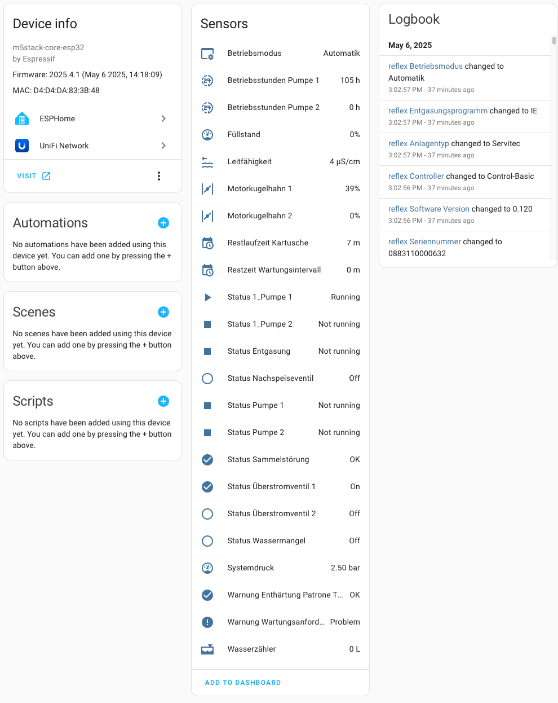

# esphome-reflex component

This is an ESPHome component to interface with a Reflex [Servitec](https://reflex-winkelmann.com/sg/products/8831100) via its
RS485 interface and provide the data to Homeassistant. It is expected but untested that other Reflex devices with 
the same controller will also work.

As an alternative the Reflex Lan optional interface can be used, for my needs it was too expensive and the controller
unit does provide a serial interface on its own.

Development/Test environment:

 * Servitec 35 (https://reflex-winkelmann.com/sg/products/8831100)
 * ATOM HUB AC/DC Remote Control Switch Kit https://docs.m5stack.com/en/atom/atomhub_switch

The atom was cosen for convenience (Din rail mount case , 230v Power input and RS485 level shifter integrated)
but any other esp32 with a serial interface will do.

| Pin  | Atom | Servitec | 
| --- | --- | --- | 
| `RS485 GND` | RS485_GND | 31 |
| `RS485 A` | RS485_A (23)  | 29 |
| `RS485 B` | RS485_B (33)  | 30 | 


## Usage
The below example will give you an Servitec with all Sensors enabled that the code currently supports.
Not all Sensors are actually in use in the Hardware I own.

```
esphome:
  name: reflex
  friendly_name: reflex

esp32:
  board: m5stack-core-esp32
  framework:
    type: arduino

logger:

wifi:
  ssid: !secret wifi_ssid
  password: !secret wifi_password

external_components:
  source:
    type: git
    url: https://github.com/martink2/esphome-reflex/
  refresh: 0s

uart:
  id: uart_bus
  tx_pin: GPIO23
  rx_pin: GPIO33
  baud_rate: 19200

reflex:
  id: reflex_s1
  uart_id: uart_bus
  update_interval: 10s
  type_serial:
    name: "Seriennummer"
  type_version:
    name: "Software Version"
  type_controller:
    name: "Controller"
  type_type:
    name: "Anlagentyp"
  type_levelcontrol:
    name: "Levelcontrol"
  para_pressurep0:
    name: "Betriebsdruck P0"
  para_pressuremax:
    name: "Diff. Max Druck"
  para_conductivitymax:
    name: "Leitfähigkeit Max"
  para_pressurensp:
    name: "Druckdiff NSP"
  para_pressuressv:
    name: "Druckdiff SV"
  para_pressurepf:
    name: "Druckdiff pf-p0"
  para_waterlevelon:
    name: "Wassermangel EIN"
  para_waterleveloff:
    name: "Wassermangel AUS"
  para_fillon:
    name: "Nachspeisung EIN"
  para_filloff:
    name: "Nachspeisung AUS"
  para_maxfillvolume:
    name: "Max Nachspeisemenge"
  para_maxfillcycles:
    name: "Max Nachspeisezyklen"
  para_maxfilltime:
    name: "Max Nachspeisezeit"
  para_maxfillimpulse:
    name: "Max Nachspeiseimpulse"
  para_scustomer:
    name: "Kunden Menü Aktiv"
  para_sservice:
    name: "Service Menü Aktiv"
  para_sro:
    name: "Schreibzugriff gesperrt"
  para_sparameter:
    name: "Parameter lokal geändert"
  para_containersize:
    name: "Behältergröße"
  para_containerweight:
    name: "Behältergewicht Leer"
  para_containerdifferenz:
    name: "Behältergewicht Voll-Leer"
  para_maintenance:
    name: "Restzeit Wartungsintervall"
  para_highwater:
    name: "Hochwasser EIN"
  para_descaler:
    name: "Restlaufzeit Kartusche"
  para_descalerremaining:
    name: "Restkapazität Weichwasser"
  para_programm:
    name: "Entgasungsprogramm"
  mes_pressure:
    name: "Systemdruck"
  mes_level:
    name: "Füllstand"
  mes_hourspump1:
    name: "Betriebsstunden Pumpe 1"
  mes_hourspump2:
    name: "Betriebsstunden Pumpe 2 "
  mes_watermeter:
    name: "Wasserzähler"
  mes_pvalve1:
    name: "Motorkugelhahn 1"
  mes_pvalve2:
    name: "Motorkugelhahn 2"
  mes_conductivity:
    name: "Leitfähigkeit"
  mes_smodus:
    name: "Betriebsmodus"
  mes_rpump2on:
    name: "Relais Pumpe 2"
  mes_rpump1on:
    name: "Relais Pumpe 1"
  mes_roverflow2open:
    name: "Relais Überstromventil 2"
  mes_roverflow1open:
    name: "Relais Überstromventil 2"
  mes_rmakeupopen:
    name: "Relais Nachspeiseventil"
  mes_rminlevel:
    name: "Relais min. Niveau"
  mes_rerror:
    name: "Relais Sammelstörung"
  mes_dpump1:
    name: "Eingang Pumpe 1"
  mes_dpump2:
    name: "Eingang Pumpe 2"
  mes_dlackofwater:
    name: "Eingang Wassermangel-Schalter"
  mes_dwatermeter:
    name: "Eingang Wasserzähler-Impuls"
  mes_dsoftstart:
    name: "Eingang Sanftanlauf"
  mes_e2mainboard:
    name: "Störung Grundplatine"
  mes_e2digitalv:
    name: "Störung digitale Spannung"
  mes_e2analogv:
    name: "Störung analoge Spannung"
  mes_e2valve1:
    name: "Störung spannung Kugelhahn 1"
  mes_e2valve2:
    name: "Störung spannung Kugelhahn 2"
  mes_e2jpressure:
    name: "Störung Jumper Druck"
  mes_e2jlevel:
    name: "Störung Jumper Niveau"
  mes_e2dryrun:
    name: "Störung Trockenlauf"
  mes_e2lackofwater3:
    name: "Störung Wassermangel 3"
  mes_e2lackofwater4:
    name: "Störung Wassermangel 4"
  mes_e2lfsensor:
    name: "Störung Lf-Sensor"
  mes_e1extensionmodule:
    name: "Störung Erweiterungsmodul"
  mes_e1eeprom:
    name: "Störung EEPROM Defekt"
  mes_e1undervoltage:
    name: "Störung Unterspannung"
  mes_e1minpressure:
    name: "Störung min Druck unterschritten"
  mes_e1lackofwater1:
    name: "Störung Wassermangel 1"
  mes_e1pump1:
    name: "Störung Pumpe 1"
  mes_e1compressor1:
    name: "Störung Kompressor 1"
  mes_e1pump2:
    name: "Störung Pumpe 2"
  mes_e1compressor2:
    name: "Störung Kompressor 2"
  mes_e1pressuresensor:
    name: "Störung Druckmessung"
  mes_e1levelsensor:
    name: "Störung Niveaumessung"
  mes_e1pressuresensorpipe:
    name: "Störung Druckmessung Sprührohr"
  mes_e1sto4h:
    name: "Störung 4h Stop Modus"
  mes_e1lackofwater2:
    name: "Störung Wassermangel 2"
  mes_e1eeprom2:
    name: "Störung EEPROM Abgleich"
  mes_w2battery:
    name: "Warnung Batterie tauschen"
  mes_w2descalechange:
    name: "Warnung Enthärtung Patrone Tauschen"
  mes_w2datalogger:
    name: "Warnung Datenlogger"
  mes_w2busmodule:
    name: "Warnung Busmodul"
  mes_w2stop4h:
    name: "Warnung 4h Stop Modus"
  mes_w2conductivity:
    name: "Warnung Leitfähigkeit überschritten"
  mes_w1maxlevel:
    name: "Warnung max. Niveau"
  mes_w1pumpruntime:
    name: "Warnung Pumpenlaufzeit"
  mes_w1makeuptime:
    name: "Warnung Nachspeisezeit"
  mes_w1maekupcycles:
    name: "Warnung Nachspeisezyklen"
  mes_w1maxpressure:
    name: "Warnung max. Druck"
  mes_w1makeupvolume:
    name: "Warnung Füllmenge"
  mes_w1expulsiontime:
    name: "Warnung Ausschiebezeit"
  mes_w1filltime:
    name: "Warnung Füllzeit"
  mes_w1fillvolume:
    name: "Warnung Füllmenge"
  mes_w1makeupvalve:
    name: "Warnung Nachspeiseventil undicht"
  mes_w1voltage:
    name: "Warnung Spannungsabfall"
  mes_w1zerolevel:
    name: "Warnung Nullbagleich"
  mes_w1parameter:
    name: "Warnung Parmeter fehlerhaft"
  mes_w1maxmakeupvolume:
    name: "Warnung max. Nachspeisemenge"
  mes_w1maintenance:
    name: "Warnung Wartungsanforderung"
  mes_smanual:
    name: "Status Manual"
  mes_sstop:
    name: "Status Stop"
  mes_sauto:
    name: "Status Automatik"
  mes_spump1:
    name: "Status 1_Pumpe 1"
  mes_spump2:
    name: "Status 1_Pumpe 2"
  mes_serror:
    name: "Status Sammelstörung"
  mes_swaterlevel:
    name: "Status Wassermangel"
  mes_sdegas:
    name: "Status Entgasung"
  mes_smakeupvalve:
    name: "Status Nachspeiseventil"
  mes_soverflow1:
    name: "Status Überstromventil 1"
  mes_soverflow2:
    name: "Status Überstromventil 2"
  mes_spump1on:
    name: "Status Pumpe 1"
  mes_spump2on:
    name: "Status Pumpe 2"
```


## Screenshot
Below is an example of the Sensors, it does not include the diganostics part which also is quite extensive.


